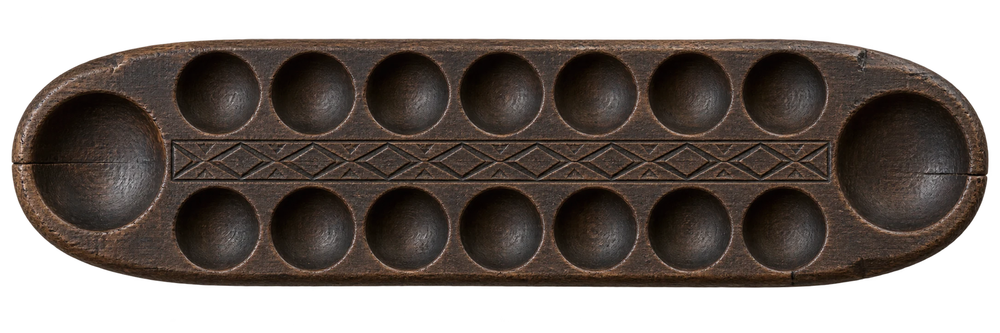

# Chenne Mane

A traditional game from coastal Karnataka, brought to the browser with an antique
wooden board, cowrie shells, and the familiar rhythm of picking up and sowing.

**[Play Chenne Mane](https://chennemane.in/)** ·
[Architecture](docs/architecture.md) · [Contributing](CONTRIBUTING.md)



## Why I built this

I wanted to bring back the feeling of playing Chenne Mane on a traditional board:
the old wood, the cowrie shells, and the small, repeated movements that can bring
back childhood memories. That feeling guided how I wanted the game to look and play.

I built it as a tribute to Tulunadu culture, with the aim of making the game easy
to reach through a link. Someone who remembers it should be able to sit down for
another round; someone discovering it should be able to learn by watching and playing.

That is why the details matter to me: an antique-looking board, shells you can pick
up and sow, a phone layout that lets you play directly on the board, and a tutorial
that shows what each action does. I wanted the interaction to carry the feeling of
the physical game onto a screen.

The rules were researched alongside the design. This version follows one documented
coastal family variant, with explicit digital finishing rules; families may remember
and play the game differently.

## What you can do

- Play against Easy, Medium, or Hard bots, or another person on the same device.
- Learn six checkpoints through an animated, replayable tutorial.
- Sow automatically or place shells by tapping, dragging, or using the keyboard.
- Use hints, undo, adjustable animation speed, and optional shell sounds.
- Play on a rotating portrait board or in native/fallback fullscreen.

## How it is built

- **One deterministic engine:** the same immutable state transitions power gameplay,
  bot search, and animation frames. Every frame accounts for all 56 shells, including
  shells in hand.
- **Independent verification:** the engine tests compare against an arithmetic oracle
  across 3,000 generated positions and 100 complete games. Other tests cover bot
  decisions, tutorial continuity, shell rendering, and fullscreen lifecycle.
- **A small browser stack:** native JavaScript modules and CSS, with no framework,
  build step, backend, or runtime npm dependencies. Prettier is development-only.

Read [the architecture and tradeoffs](docs/architecture.md) for move cancellation,
bot search, testing boundaries, and the distinction between traditional and digital rules.

## Run locally

With Python 3 installed:

```sh
python3 -m http.server 4173 --bind 127.0.0.1 --directory dist
```

Open [localhost:4173](http://127.0.0.1:4173). Edit files in `dist/` and refresh the
page. This folder contains the original, committed website files. The browser runs
them directly; there is no generated copy or build step.

Deploy only `dist/` to a static host at the domain root. Asset URLs assume `/`,
so a GitHub Pages project subpath needs additional configuration.

For development checks, use Node.js 22 or newer:

```sh
npm ci
npm test          # Run automated tests
npm run format    # Format source and documentation
npm run check     # Check formatting and run tests
```

GitHub Actions runs these checks on Node 22 and 24 and scans for secrets.
No API keys or environment variables are needed.

## Project map

| Location                              | Contents                                                     |
| ------------------------------------- | ------------------------------------------------------------ |
| `dist/engine.mjs`, `dist/bot.mjs`     | Rules, state transitions, and bot decisions                  |
| `dist/app.js`                         | Input, game state, animation coordination, and browser tools |
| `dist/tutorial.mjs`, `dist/setup.mjs` | Learning checkpoints and preference preview                  |
| `dist/fullscreen.mjs`                 | Fullscreen, focus, and viewport lifecycle                    |
| `dist/assets/`                        | Board, shell, and cultural artwork                           |
| `scripts/`                            | Reviewed source-export tool                                  |
| `tests/`                              | Automated checks using Node's built-in runner                |
| `docs/`                               | Architecture, game rules, and sources                        |
| `dist/`                               | Editable, committed website files                            |

## Current boundaries

Matches stay in memory and restart on refresh; preferences are saved locally.
Multiplayer is on the same device. Traditional redistribution rounds and alternate
capture presets are not implemented. There is no application analytics; Google
Fonts is requested externally.

The tests include simulated browser objects, not a complete browser test suite.
See [architecture](docs/architecture.md) for testing coverage and
[game rules and sources](docs/rules.md) for the implemented variant.

## Contribute and reuse

Useful contributions include real-device accessibility testing, carefully sourced
regional variants, and reviewed translations. Start with [CONTRIBUTING.md](CONTRIBUTING.md).
Report sensitive issues using [SECURITY.md](SECURITY.md).

Code and original project material are available under [MIT](LICENSE).
[ASSETS.md](ASSETS.md) explains the AI-assisted artwork and font sources.
